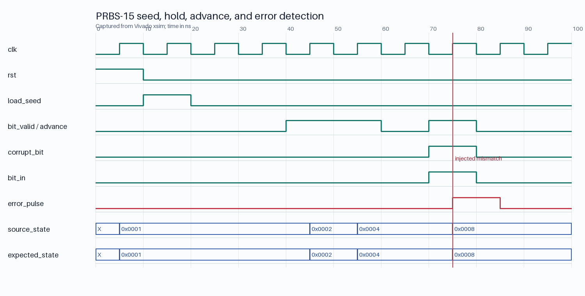

# Milestone 03 verification evidence

The PRBS-15 convention and golden vectors are frozen in
[`docs/protocol.md`](../../protocol.md).

## Automated results

| Test | Result |
|---|---|
| Generator golden vector | First 64 bits matched |
| Generator period | Seed recurred after exactly 32,767 advances |
| Illegal state | Zero was never visited; forced zero recovered to the seed |
| Generator checks | 65,610 passed |
| Checker clean loopback | 100,000 comparisons, zero errors |
| Checker injection | Exact errors at bit indices 0, 17, and 999 |
| Checker checks | 101,089 passed |

Simulator transcripts:

- [`tb_prbs15_gen.txt`](tb_prbs15_gen.txt)
- [`tb_prbs15_check.txt`](tb_prbs15_check.txt)

Focused Vivado xsim waveform:

In the waveform, `load_seed` aligns both states to `0x0001`. The states remain
unchanged while `bit_valid` is low, advance together on valid bits, and produce
a one-cycle `error_pulse` when `corrupt_bit` flips a valid received bit.
