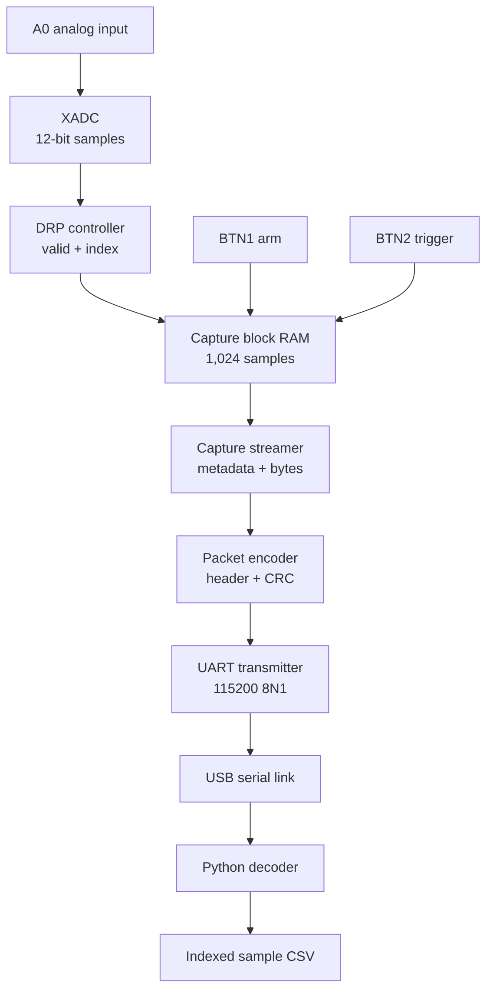

# Milestone 07 — Capture buffer and UART evidence path

**Depends on:** [Milestone 06](06-xadc-acquisition.md)

**Produces:** A bounded 1,024-sample acquisition tap, a checked UART packet
path, and a reusable Python decoder/CSV capture tool

## What this milestone does

The XADC produces samples at about 240 kSa/s, but a 115200-baud UART cannot
carry that stream continuously. This design separates acquisition from
transport:

1. BTN1 arms an empty block-RAM capture buffer.
2. BTN2 triggers capture on the next `sample_valid` event.
3. Exactly 1,024 valid XADC samples are written at the acquisition rate.
4. The frozen buffer is read afterward and wrapped in one CRC-protected packet.
5. The UART sends that packet to the PC, where Python verifies and decodes it.

The UART never backpressures the XADC. Samples are transmitted only after the
full-rate capture has finished.

## Block flow



## Implemented structure

| Component | Responsibility |
|---|---|
| `rtl/acquisition/sample_capture.sv` | Arm/trigger state and 1,024 × 12-bit block RAM |
| `rtl/control/capture_streamer.sv` | Converts frozen metadata and RAM samples to payload bytes |
| `rtl/control/packet_tx.sv` | Adds header, sequence, and CRC through ready/valid handshakes |
| `rtl/common/crc16_ccitt.sv` | Streaming CRC-16/CCITT-FALSE calculation |
| `rtl/common/uart_tx.sv` | 115200-baud, 8N1, LSB-first serial transmitter |
| `rtl/top/capture_uart_bringup_top.sv` | XADC-to-capture-to-UART integration |
| `host/optical_dsp_host/` | Reusable packet decoder and serial transport |
| `host/capture_samples.py` | Receives one capture and writes indexed raw codes to CSV |

## Physical controls and indicators

| Board item | FPGA pin | Use |
|---|---|---|
| BTN0 | D9 | Reset |
| BTN1 | C9 | Arm a new empty capture |
| BTN2 | B9 | Trigger the armed capture |
| A0 / VAUX4 P | C6 | Analog input |
| A0 / VAUX4 N | C5 | Analog return |
| USB-UART TX | D10 | FPGA transmit data to the PC |
| LD4 | H5 | Armed |
| LD5 | J5 | Capturing |
| LD6 | T9 | Capture complete / frozen |
| LD7 | T10 | Sticky acquisition, control, or packet fault |

BTN1 and BTN2 are synchronized and converted to rising-edge pulses. Press BTN1
first, then BTN2. A trigger received when the buffer is not armed sets the
sticky rejected-trigger indication. Reset clears sticky status.

## Frozen UART convention

| Item | Value |
|---|---|
| Requested baud | 115200 |
| FPGA clock | 100 MHz |
| Integer bit period | 868 clocks |
| Actual baud | 115207.373 baud |
| Baud error | +0.0064% |
| Framing | 8 data bits, no parity, 1 stop bit |
| Bit order | Data bit 0 first; line idle high |

`data_valid` may remain asserted until `data_ready`. A byte transfers on the
clock where both are high; UART then owns an internal copy for all ten serial
bit periods.

## Frozen packet convention

```text
A5 5A | version | type | payload_length_le | sequence_le | payload | crc_le
  2 B |    1 B  | 1 B  |       2 B        |     2 B     | 0..4096 | 2 B
```

- Version is `01` and capture packet type is `02`.
- All multi-byte transport and capture fields are little-endian.
- CRC is CRC-16/CCITT-FALSE: polynomial `0x1021`, initial value `0xFFFF`, no
  reflection, no final XOR, processed MSB-first within each byte.
- CRC covers `version` through the final payload byte; it excludes sync and the
  appended CRC bytes.
- The Python streaming decoder searches for `A5 5A`, rejects impossible lengths
  or CRC failures, discards one byte, and searches again. It preserves a lone
  trailing `A5` so sync can span two serial reads.

The capture payload is:

```text
start_index_le[8] | sample_count_le[2] | format[1] | samples[count][2]
```

Format `01` means one unsigned 12-bit XADC code in the low bits of each
little-endian 16-bit sample field. Bits 15:12 must be zero.

## Capture behavior

The capture FSM has four states: idle, armed, active, and complete. `arm` clears
the previous metadata and prepares the buffer. `trigger` changes armed to
active. Each `sample_valid` writes one code; gaps do not consume addresses.
The first accepted sample's 64-bit acquisition index is saved as
`capture_start_index`. After entry 1,023, memory and metadata freeze until the
next accepted arm.

The RAM has one acquisition write port and a separate synchronous read port.
The streamer explicitly waits for read latency, so simulation and inferred FPGA
RAM have the same behavior.

## Automated verification

- `tb_uart_tx.sv`: exact bit duration, independent decode of `00`, `FF`, `55`,
  `A6`, held-valid back-to-back traffic, and reset during a byte.
- `tb_crc16_ccitt.sv`: published `123456789` result `0x29B1`.
- `tb_sample_capture.sv`: gapped ramp, count/index/order, busy-trigger rejection,
  synchronous readback, and reset from every state.
- `tb_packet_tx.sv`: zero, ordinary, and maximum payloads, backpressure,
  oversize rejection, exact header, and independently calculated CRC.
- `tb_capture_streamer.sv`: integrated RAM-to-packet path checked byte-for-byte
  against the same frozen fixture decoded by Python.
- `host/tests/test_protocol.py`: packet encoding, CRC rejection, fragmented
  input, noise recovery, capture parsing, and the cross-language fixture.

## Build, program, and receive

```powershell
.\scripts\fpga.cmd build `
    -BuildScript scripts\build_capture_uart_bringup.tcl

.\scripts\fpga.cmd program `
    -Bitstream artifacts\bitstreams\capture_uart_bringup_top.bit

python -m pip install pyserial
python host\capture_samples.py COM5 --output artifacts\captures\a0-ground.csv
```

Replace `COM5` with the Arty USB-UART port. Start the Python receiver, press
BTN1, then BTN2. A full 1,024-sample capture contains 2,069 UART bytes and takes
about 179.6 ms on the wire. Filling the RAM takes about 4.26 ms at the expected
Milestone 6 sample rate; transport happens afterward.

## Done when

- [x] Full-rate acquisition continues while the bounded buffer fills.
- [x] Simulated captures contain exact ordered samples and starting index.
- [x] Packets pass the RTL-to-Python fixture with verified CRC.
- [x] UART reset, timing, and back-to-back behavior are tested.
- [x] The host decoder is structured for Milestone 13 reuse.
- [x] Grounded and nominal-3.3 V A0 captures were received and saved as CSV.

Milestone 7 is complete. Independent voltage calibration and BPW34 measurements
belong to the following analog-characterization milestone.

## What this unlocks

Milestone 08 can characterize the real BPW34 analog path using captured sample
blocks instead of estimating behavior from an LED.
