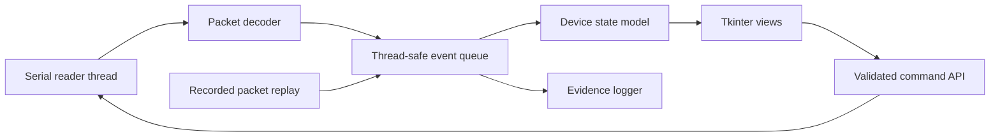

# Milestone 14 — Local dashboard and internal tools

**Time box:** 2 days
**Depends on:** [Milestone 13](13-uart-control-and-telemetry.md)
**Produces:** A reusable headless host library, evidence logger, replay mode,
and local user-facing GUI

## Why this milestone exists

The dashboard is both internal instrumentation and the final user interface. It
must display what the FPGA measured rather than reimplementing symbol decisions
or BER in Python. Building it after the protocol is frozen prevents UI choices
from continuously changing RTL.

## Recommended technology boundary

Use a simple local Python desktop application:

- `pyserial` for UART;
- Python `threading` plus `queue.Queue` for background serial I/O;
- `tkinter` for the GUI shell; and
- `matplotlib` embedded for sample/history plots.

This stack is deliberately modest and explainable. A browser UI, web server,
database, or cloud service is not required. If you already know another desktop
GUI toolkit, you may substitute it while preserving the architecture below.

## Permanent host structure

```text
host/
├── optical_dsp_host/
│   ├── protocol.py            # existing encode/decode and data classes
│   ├── serial_transport.py    # existing connection/read/write ownership
│   ├── commands.py            # existing command/ACK layer
│   ├── state.py               # latest immutable device/run state
│   ├── logger.py              # JSONL/CSV evidence and manifests
│   ├── replay.py              # drive the app from recorded packets
│   └── dashboard.py           # GUI composition and user actions
├── tests/
│   ├── fixtures/              # small recorded packet streams
│   ├── test_state.py
│   ├── test_logger.py
│   └── test_replay.py
└── run_dashboard.py
```

The command-line utility from Milestone 13 remains useful for automation. Both
CLI and GUI import the same protocol, transport, state, and logger code.

## Architecture to implement



The GUI main thread alone updates widgets. The serial worker places decoded
events into a queue; it never touches the GUI directly.

## Required dashboard views

### Connection/build

- serial port and connect/disconnect;
- protocol/build ID and compatibility warning;
- FPGA target and configured profiles;
- last packet time, packet sequence gaps, and CRC/parser errors.

### Link status

- run ID and running/stopped state;
- TX mode and rate profile;
- calibration state, selected phase, threshold, and quality score;
- frame lock, lock acquisitions/losses, sequence discontinuities;
- compared bits, bit errors, BER, and zero-error 95% upper bound;
- sticky XADC, saturation, capture, UART, and framing faults.

### Controls

- OFF/ON/TRAINING/FRAMED mode with a confirmation for laser-on modes;
- rate profile;
- filter bypass/bank;
- calibrate;
- start/stop run;
- snapshot/reset counters; and
- choose a sample tap and trigger bounded capture.

Controls remain disabled until build/protocol compatibility is confirmed.

### Plots

- latest sample capture versus index;
- histogram of captured values;
- BER/errors/lock state versus time from status snapshots; and
- optional raw/DC/FIR comparison when corresponding captures exist.

The GUI computes display ratios and confidence bounds from FPGA raw counters.
It must never change the underlying counts.

## Evidence logger

Every run should create a directory containing:

- manifest with Git commit, bitstream hash/build ID, hardware IDs, settings, and
  timestamps;
- raw received packets or a compact JSONL event log;
- status/counter CSV;
- capture files with sample index and tap metadata;
- command/ACK log; and
- final summary with pass/fail reasons.

Write files incrementally so an interrupted run retains useful evidence. Use UTC
timestamps internally and display local time only in the UI.

## Replay mode

Replay recorded decoded events through the same queue/state/view path at a
selectable speed. It provides:

- GUI development without hardware;
- repeatable regression tests;
- a demo fallback that is clearly labeled replay, never live evidence; and
- protection against UI changes corrupting protocol interpretation.

## Python learning guidance

- Use small immutable data classes for decoded packet/status records.
- Separate transport errors, protocol errors, device faults, and UI messages.
- Do not let widgets become the source of truth; update them from a state model.
- Queue commands and match ACKs by transaction ID with a timeout.
- Treat serial disconnect as a state transition, not an exception that crashes
  the app.
- Keep plotting rate bounded; receiving 10 status packets per second does not
  require redrawing every widget ten times per second.
- Keep GUI logic thin enough that calculation functions can be unit tested
  without creating a window.

## Test requirements

1. Protocol fixture updates the exact expected state fields.
2. Out-of-order/duplicate status packet handling follows a documented policy.
3. Counter delta across snapshots is correct; counter reset/run-ID change does
   not create a false negative delta.
4. BER formatting handles zero bits, zero errors, and non-zero errors.
5. Zero-error confidence bound displays approximately `3/N` and is labeled.
6. Logger round-trip preserves integer counters without float conversion.
7. Replay produces the same final state as live fixture ingestion.
8. Disconnect/reconnect and command timeout do not freeze the GUI.
9. Corrupted/incompatible fixture displays an error and disables controls.
10. Manual GUI checklist covers every control and plot in both replay and live
    modes.

## Hardware verification

- Connect and identify the build.
- Trigger calibration and watch phase/threshold update.
- Start a framed run and verify counters continue if the dashboard disconnects.
- Reconnect and recover current state without FPGA reset.
- Request raw/DC/FIR captures and compare metadata.
- Save a complete short run, close the app, and replay it to the same final
  displayed state.

## Completion evidence

- Screenshot of live dashboard with build ID, lock, counters, and a capture.
- Passing host unit tests and replay test.
- One complete logged run directory with manifest and hashes.
- Short user guide covering connect, calibrate, run, capture, stop, and replay.
- Architecture explanation covering thread ownership and why DSP/BER remain in
  FPGA hardware.

## Done when

- [ ] CLI and GUI share one tested host library.
- [ ] The GUI remains responsive through disconnects and malformed packets.
- [ ] Controls are acknowledged and never assumed applied without ACK.
- [ ] Evidence is reproducible from recorded logs/replay.
- [ ] The dashboard displays FPGA results without performing receive decisions.

## What this unlocks

Milestone 15 can automate and present the final qualification without changing
the RTL architecture or inventing one-off measurement scripts.
