# Learning milestone index

Current position (2026-08-20): Milestones 01 through 08 are complete with
documented follow-ups. The selected receiver is `pd02` with a 100 kΩ external
load at 7.4 cm. Repeated 1 and 10 kbit/s training and a blocked-path test passed.
Milestone 09 fixed-point DC removal is implemented; bit-exact simulation and
the routed build pass, and physical before/after captures remain.

This directory is the implementation path for the project. The milestones are
ordered so that each new block has a stable interface, can be tested without
the entire system, and remains useful in the finished design. You write the RTL,
testbenches, Python, and explanations yourself; these guides provide contracts,
design context, hints, and evidence requirements rather than completed code.

## How to work through a milestone

For every milestone:

1. Read the complete guide before coding.
2. Restate the block's behavior and interface in your own words in a short
   design note.
3. Draw the state machine or datapath on paper before writing RTL.
4. Write the smallest self-checking testbench that proves the stated contract.
5. Implement until the testbench passes, then run synthesis/lint checks.
6. Integrate only after the unit test is stable.
7. Copy the [completion report template](completion-template.md) and save a
   short report with commands, results, failures encountered, what you learned,
   and the Git commit.

Do not move on because a waveform “looks right.” A milestone is complete only
when its automated checks and listed evidence exist.

## Permanent architecture

```mermaid
flowchart LR
    TIMING["Reset + clock enables"] --> PRBS["PRBS-15 source"]
    PRBS --> FRAME["Training/framed TX"]
    FRAME --> LASER["Guarded GPIO + DAOKI laser control input"]
    LASER --> OPTICAL["Short enclosed channel"]
    OPTICAL --> BPW["BPW34 + load resistor"]
    BPW --> XADC["Arty XADC acquisition"]
    XADC --> TAP["Bounded sample capture"]
    XADC --> DC["DC removal"]
    DC --> FIR["FIR"]
    FIR --> PHASE["Phase selection + threshold"]
    PHASE --> SYNC["Frame sync + BER"]
    SYNC --> STATUS["Control/status registers"]
    TAP --> UART["UART protocol"]
    STATUS --> UART
    UART --> HOST["Python host library"]
    HOST --> LOG["Headless command utility + evidence logger"]
```

The DAOKI digital receiver is a diagnostic branch used in Milestone 05. It
proves safe optical switching and alignment, but it never replaces the BPW34
analog path in the final receiver.

## Shared contracts frozen for the guides

These are defaults. Change one only through a documented decision because later
milestones and test vectors depend on them.

| Contract | Baseline |
|---|---|
| Board clock | 100 MHz Arty A7 oscillator |
| RTL language | SystemVerilog for synthesizable logic and testbenches |
| Reset | Synchronous, active-high internal reset; external reset is synchronized once |
| Clocking style | One main FPGA clock with one-cycle clock-enable pulses; no fabric-generated clocks |
| Laser polarity | Logical `1` means commanded laser-on at the guarded KY-008 control input |
| XADC stream | Unsigned 12-bit sample plus one-cycle `sample_valid` and monotonic sample index |
| Qualification sampling | 250 kSa/s |
| Symbol profiles | 1 kbit/s bring-up, 10 kbit/s qualification, 25 kbit/s optional stretch |
| Primary profile | 25 samples/symbol at 10 kbit/s |
| PRBS | PRBS-15, polynomial `x^15 + x^14 + 1`, non-zero seed frozen in Milestone 03 |
| Optical frame | 32 alternating preamble bits, 16-bit sync, 16-bit sequence, 1024 PRBS payload bits |
| Fixed-field order | Most-significant bit first; payload order follows the PRBS output convention |
| UART | 115200 baud, 8 data bits, no parity, one stop bit |
| Host transport | Bounded binary packets with sync, version, type, length, sequence, payload, CRC-16 |

### Sample-stream interface

Receive-side blocks should use the same conceptual interface:

| Signal | Meaning |
|---|---|
| `clk` | 100 MHz system clock |
| `rst` | Synchronous active-high reset |
| `in_valid` | The input sample is real on this cycle |
| `in_sample` | Signed or unsigned sample, documented by the block |
| `out_valid` | Output sample is real on this cycle |
| `out_sample` | Transformed sample |

The physical acquisition path cannot be backpressured. Do not add `ready` to a
DSP block unless the design explicitly includes a FIFO boundary and proves that
no XADC sample can be lost. Every block documents latency in valid samples and
its rounding, saturation, and reset behavior.

## Milestone sequence

| # | Milestone | Main permanent result | Typical time |
|---:|---|---|---:|
| 01 | [Lab, tools, and design notebook](01-lab-tools-and-contracts.md) | Reproducible terminal workflow and frozen hardware record | 1 day |
| 02 | [Reset and clock-enable foundation](02-reset-and-clock-enables.md) | Reusable reset and timing primitives | 1-2 days |
| 03 | [PRBS-15 source and checker](03-prbs15-source-and-checker.md) | Independently verified deterministic test data | 1-2 days |
| 04 | [Optical training pattern and framer](04-training-pattern-and-framer.md) | Permanent transmit bitstream generator | 1-2 days |
| 05 | [Laser transmitter and DAOKI digital bring-up](05-laser-and-daoki-bringup.md) | Safe physical TX path and diagnostic RX path | 1-2 days |
| 06 | [Single-channel XADC acquisition](06-xadc-acquisition.md) | Stable 12-bit sample stream | 1-2 days |
| 07 | [Capture buffer and UART evidence path](07-capture-buffer-and-uart.md) | Reusable capture tap, UART TX, and host decoder | 2 days |
| 08 | [BPW34 analog-link characterization](08-bpw34-analog-link.md) | Final detector/load choice and measured signal envelope | 1-2 days |
| 09 | [Fixed-point DC removal](09-dc-removal.md) | Bit-true baseline-restoration stage | 1-2 days |
| 10 | [Readable FIR filter](10-fir-filter.md) | Parameterized direct-form receive filter | 2 days |
| 11 | [Sample phase and threshold decision](11-phase-and-threshold.md) | Training-assisted symbol decisions | 2 days |
| 12 | [Frame synchronization and BER engine](12-frame-sync-and-ber.md) | Hardware lock and error measurement | 2 days |
| 13 | [UART control and telemetry plane](13-uart-control-and-telemetry.md) | Stable hardware/host command protocol | 2 days |
| 14 | [Integration, qualification, and demo](14-integration-and-qualification.md) | Reproducible final project and evidence | 2 days |

## Definition of “hand-coded” for this project

- You may instantiate the vendor XADC primitive because the ADC is hardened
  silicon, but you write and explain its wrapper, sequencing, and data capture.
- You may use Vivado synthesis, simulation, and programming tools; generated
  project files are not source code.
- Standard Python libraries and small dependencies such as `pyserial` and
  `matplotlib` are acceptable. Your protocol, state management, plots, controls,
  and evidence logic remain yours.
- Do not import a PRBS, framer, UART, FIR, BER, or full host-control implementation.
  Those are the learning targets.
- Testbench helper tasks are encouraged. Copying the RTL algorithm verbatim into
  the testbench is not an independent check.

## Upgrade policy

Finish the baseline before upgrading it. Ideas such as a transimpedance
amplifier, external ADC, Ethernet/UDP, adaptive equalizer, faster optical
module, or independent transmitter clock belong in a post-V1 backlog unless a
baseline milestone proves that the current hardware cannot meet 10 kbit/s.
This avoids parallel prototypes and protects the short learning cycle.
