# FPGA optical DSP platform — project plan

> **Document status:** Implementation-ready learning plan, revision 0.3
> **Project status:** Pre-implementation; parts selected, arrival inspection and
> electrical gates remain open
> **Primary target:** Digilent Arty A7-100T (`xc7a100tcsg324-1`)
> **V1 emphasis:** Hand-written, explainable components; measurable receive DSP;
> reproducible evidence; and a terminal-first workflow

## 1. Executive decision

Build a single-channel, real-time, intensity-modulated optical link whose
receive path is implemented entirely in FPGA fabric. V1 will use NRZ on-off
keying (OOK), a DAOKI KY-008-style 650 nm transmitter, a BPW34-style PIN
photodiode, and the Arty A7's built-in 12-bit XADC. The low-cost DAOKI digital
receiver is retained as a bring-up and alignment aid; it is not the DSP
receiver. The FPGA performs symbol recovery and BER computation. The host may
configure, visualize, and archive results but cannot create the accepted BER
result in software.

The first qualification profile is intentionally modest and testable:

| Parameter | V1 qualification value | Rationale |
|---|---:|---|
| XADC sample rate | 250 kSa/s | Conservative operating point below the XADC's 1 MSa/s ceiling |
| Line rate | 10 kbit/s | Provides 25 samples/symbol and suits a hobby-scale passive front end |
| Modulation | NRZ OOK | Matches direct optical intensity modulation |
| ADC resolution | 12 bits | Uses hardware already present on the Arty A7 |
| FIR baseline | Readable parameterized direct-form, qualified at 8 and 16 taps | Prioritizes understanding and traceability over resource minimization |
| Telemetry rate | 10 packets/s nominal | Responsive monitoring without coupling DSP to host load |
| Host control | 115200-baud USB-UART packet link | Simple enough to hand-code and sufficient for bounded captures plus status |
| Soft processor | None | Keeps acquisition, recovery, measurement, and transport inspectable in RTL |

The 10 kbit/s result is a qualification target, not a claim about the Amazon
modules before measurement. A 1 kbit/s bring-up profile and a 25 kbit/s stretch
profile use the same 250 kSa/s acquisition rate. The stretch profile is attempted
only if measured transmitter, photodiode/load, and XADC waveforms support it.

## 2. Success statement

V1 is complete only when the physical system can, continuously and without
host assistance:

1. generate a framed PRBS test stream in FPGA fabric;
2. control the DAOKI optical transmitter through a transistor switch without
   sourcing laser current from an FPGA pin;
3. receive and condition the optical signal with the BPW34-style detector and
   a characterized, voltage-bounded front end;
4. acquire every scheduled XADC sample without loss or discontinuity;
5. remove DC offset, filter the signal, recover sample phase, and make binary
   decisions using bit-true fixed-point logic;
6. acquire and retain PRBS lock with explicit hysteresis;
7. count compared bits, bit errors, frames, lock losses, dropped samples, and
   transport errors in hardware;
8. expose coherent statistics and bounded captures over USB-UART to a local
   headless command utility and evidence logger;
9. run a controlled, paired DSP-off/on comparison and report whether the DSP
   changes BER and signal quality, including a neutral result if confidence is
   insufficient; and
10. publish routed timing, resource, latency, throughput, integrity, and
    physical-test evidence tied to a source commit and bitstream hash.

An attractive live waveform or a few correctly received bytes is a bring-up
result, not completion.

## 3. Scope boundaries

### 3.1 In scope for V1

- Arty A7-100T and its 100 MHz system clock, USB-JTAG/UART, user I/O, and Pmod
  or shield expansion.
- One optical transmit path and one direct-detection receive path.
- NRZ OOK with deterministic framing and PRBS payloads.
- The Arty A7 XADC, initially using one 0-3.3 V-capable single-ended A0-A5
  channel through the board's scaling network.
- A BPW34-style detector with a passive load-resistor front end, followed by a
  transimpedance amplifier only if measurements show it is necessary.
- Continuous XADC acquisition and bounded raw-sample capture.
- Fixed-point DC removal, FIR filtering, oversampled timing/sample selection,
  binary decision, framing, PRBS checking, and BER/statistics.
- Custom RTL data/control plane with no MicroBlaze dependency.
- Self-checking simulation, bit-true software models, hardware qualification,
  and machine-readable benchmark evidence.
- A bounded UART control/telemetry protocol, reusable Python host library,
  headless command utility, and evidence logger.

### 3.2 Explicitly deferred

- Coherent detection, carrier recovery, optical phase processing, PAM4/QAM,
  multi-channel/WDM, or multi-Gb/s operation.
- Forward error correction or claims based on corrected rather than raw BER.
- A custom PCB, long-distance/free-space reliability claims, calibrated optical
  power measurements, or unattended/unenclosed laser operation.
- A purchased external ADC unless the onboard XADC is proven to be the limiting
  factor after the 25 kbit/s stretch profile is attempted.
- Ethernet/IPv4/UDP transport. It is a post-V1 upgrade after the local UART
  tooling and qualification are complete.
- General-purpose TCP, DHCP, web serving, or a full commercial network stack.
- DDR buffering in the critical receive path.
- Fractional-delay interpolation, Gardner/Mueller-and-Muller recovery, or
  adaptive equalization until the oversampled V1 receiver is accepted.
- A production enclosure, regulatory certification, or unattended deployment.

## 4. System architecture and contracts

```mermaid
flowchart LR
    SYS["100 MHz board clock"] --> TXCE["Integer symbol clock enable"]
    TXCE --> FRAME["Framer + PRBS generator"]
    FRAME --> TXIO["GPIO + transistor laser switch"]
    TXIO --> TXLASER["DAOKI 650 nm transmitter"]
    TXLASER --> OPT["Enclosed short optical channel"]
    OPT -. alignment bring-up .-> DIGRX["DAOKI digital receiver"]
    OPT --> PD["BPW34-style photodiode"]
    PD --> AFE["10 kΩ load / measured AFE"]
    AFE --> ADC["Arty 12-bit XADC on A0"]
    ADC --> ACQ["XADC capture + sample FIFO"]
    ACQ --> DC["DC estimator / subtractor"]
    DC --> FIR["Programmable fixed-point FIR"]
    FIR --> TIM["Phase metric + sample strobe"]
    TIM --> DEC["Threshold decision"]
    DEC --> SYNC["Frame / PRBS synchronizer"]
    SYNC --> BERT["64-bit BER + link counters"]
    BERT --> SNAP["Coherent status snapshot"]
    SNAP --> UART["Bounded UART packets"]
    UART <--> HOST["Host command utility + evidence logger"]
    UART --> CTRL["Validated idempotent controls"]
    CTRL --> FRAME
    CTRL --> FIR
    CTRL --> TIM
```



### 4.1 Clock-domain plan

| Domain | Expected source | Responsibilities | Crossing rule |
|---|---|---|---|
| `sys_clk` | Arty 100 MHz oscillator | Control, TX clock enables, DSP scheduling, counters | Default synchronous domain |
| `xadc_dclk` / sample event | Derived from `sys_clk` for the XADC DRP | XADC sequencing, reads, and sample-valid generation | Keep synchronous to `sys_clk` where practical; otherwise use an explicit handshake/FIFO |

All clocks and generated clocks must be constrained. Multi-bit values may cross
domains only through an asynchronous FIFO, a request/acknowledge snapshot, or a
proven Gray-code counter scheme. Broad false paths are prohibited. Each CDC
waiver must identify the circuit, reason, and reviewer.

### 4.2 Streaming sample contract

Internal receive stages use one explicit sample contract:

- `valid` marks a real ADC sample; gaps are legal unless a stage declares a
  continuous-rate requirement.
- `ready` is used only where backpressure is physically safe. The continuous
  XADC sample schedule is not stalled by downstream logic; any acquisition
  overflow or skipped end-of-conversion event fails the run.
- `sample` is signed two's-complement after input centering.
- `sample_index` is a monotonic 64-bit count maintained at acquisition.
- `sof`/`sync_epoch` metadata is added only after synchronization; it is never
  inferred from host packet boundaries.
- Reset clears valid state and lock state. Counters use a deliberate snapshot
  and reset protocol rather than asynchronous host reads.

Every module must document latency in accepted input samples, whether it can
create/drop samples, reset behavior, numeric range, and saturation behavior.

### 4.3 Framing and PRBS baseline

The V1 wire pattern is framed so acquisition, lock, and error accounting are
separable:

```text
32 alternating preamble bits -> 16-bit sync -> 16-bit frame sequence
                              -> 1024 PRBS-15 payload bits
```

The exact sync word, bit order, PRBS convention/seed, reset behavior, preamble
tolerance, and lock thresholds are frozen in `docs/protocol.md` during the
linked milestones. PRBS-15 is the only V1 payload pattern so TX and RX do not
accumulate parallel implementations.

BER counts only payload bits compared while locked. Framing misses and lock
losses are reported separately so the BER number cannot hide synchronization
failures.

### 4.4 Provisional fixed-point contract

These widths are the starting point for the bit-true model, not permission to
skip range analysis:

| Quantity | Provisional representation |
|---|---|
| Raw ADC | Unsigned 12-bit |
| Centered sample | Signed 13-bit |
| DC estimate | At least 20 bits including fractional guard bits |
| FIR coefficient | Signed 16-bit, Q1.15 |
| Product | Signed 29-bit |
| 16-tap accumulator | Signed 34-bit minimum |
| Filter output | Signed 16-bit after defined rounding and saturation |
| Timing/threshold metrics | Width derived from maximum observation window, with one sign and at least one guard bit |

Milestones 09-11 freeze the actual widths using worst-case bounds and bit-true
tests.
Wraparound in the signal path is not allowed. Rounding mode, tie behavior,
saturation limits, coefficient normalization, and reset transients must be
bit-exact between the model and RTL.

### 4.5 Timing-recovery claim boundary

V1 uses oversampling and training-assisted discrete sample-phase selection. At
the 25 samples/symbol qualification point, known alternating training symbols
measure on/off separation at every phase. The best phase and midpoint threshold
are latched for framed receive operation. Fractional interpolation is deferred.

On a single Arty board, TX and ADC conversion ultimately share the same crystal.
Synthetic phase offsets test all integer sample positions, but they do not prove
tolerance to independent oscillator jitter or drift. Any claim of asynchronous
clock recovery requires either:

- a separately clocked optical transmitter;
- a second FPGA board; or
- a characterized independent clock source.

Reports must label injected common-reference tests and independent-clock tests
separately.

### 4.6 UART telemetry/control contract

UART is transport, not the measurement engine. Each bounded binary packet
contains at least:

```text
sync | protocol version | message type | payload length | packet sequence
payload | CRC-16
```

The status payload includes coherent 64-bit counters, configuration echo,
current state, lock state, rates, overflow flags, and sticky fault bits. Unknown
protocol versions or invalid lengths are rejected. Mutating controls carry a
transaction ID and return an acknowledgement so retries are idempotent.

Required V1 controls are limited to info/status, start/stop, safe TX mode,
profile selection, calibration, filter enable/coefficient-bank selection,
bounded threshold override, counter snapshot/reset, and bounded sample capture.
Arbitrary memory writes and unbounded streaming are out of scope.

## 5. Hardware baseline and decision gates

### 5.1 FPGA board

Baseline: Digilent Arty A7-100T. Digilent lists the board's
`XC7A100TCSG324-1`, 240 DSP slices, 4,860 Kbits of block memory, USB-JTAG,
10/100 Ethernet, and four Pmod connectors. The board selection is frozen only
after the physical board revision and part reported over JTAG are recorded.

If the available board is an Arty A7-35T, all resource budgets and the expected
part in the programming flow must be changed before implementation. A design
that happens to synthesize for both parts is not a substitute for declaring
the acceptance target.

### 5.2 Onboard XADC baseline and gate

V1 uses the Arty A7's built-in dual 12-bit XADC rather than purchasing an
external ADC. The converter is capable of up to 1 MSa/s, but the qualification
profile deliberately requests one A0 channel at 250 kSa/s. Digilent's A0-A5
single-ended analog inputs include a board-level network that scales an
external 0-3.3 V signal into the FPGA's 0-1 V XADC range. The A6-A11 and
dedicated differential inputs do not provide that same 0-3.3 V assumption and
are excluded from the first prototype.

**XADC gate deliverable:** `docs/hardware/xadc-interface.md` must record:

- the selected A0-A5 pin and exact master-XDC constraints;
- XADC reference, clock, averaging, acquisition, sequencing, and DRP settings;
- external 0-3.3 V limits versus the internal XADC code conversion;
- measured grounded/dark noise, offset, full-scale behavior, and effective
  sample rate;
- source-impedance and settling checks for each tested load resistor; and
- the condition that would justify an external ADC purchase.

The external-ADC decision is reopened only if the analog link works at
10 kbit/s and measurements show the XADC—not the laser, alignment, photodiode,
or passive front end—prevents the 25 kbit/s stretch profile.

### 5.3 Selected optical parts and assigned roles

The initial purchase is the DAOKI kit identified by Amazon ASIN `B091GBJLX5`.
The listing claims four KY-008-style 650 nm, nominal 5 mW transmitters, four
non-modulated digital receiver modules, and Dupont leads. Marketplace text is
not a primary datasheet: pinout, operating current, output level, switching
bandwidth, and laser classification remain unverified until the delivered
parts are inspected and measured.

The analog receiver purchase is the five-device BPW34/BPW34S-style listing
identified by Amazon ASIN `B0F4CNXCMX`. These are through-hole silicon PIN
photodiodes sold by a third party, not traceable Vishay parts. The Vishay BPW34
datasheet is the design starting point—visible/near-infrared response including
650 nm, 7.5 mm² active area, and nominal fast response—but acceptance uses
measurements of the delivered devices. All five devices are screened for dark,
laser-on, and transition response; the selected device ID is recorded in every
physical benchmark.

The parts serve different purposes:

| Path | Hardware | Accepted use | Not accepted as evidence of |
|---|---|---|---|
| Digital bring-up | DAOKI TX + DAOKI digital receiver | Alignment, beam block/unblock, polarity, and very-low-rate OOK experiments | Analog waveform quality, XADC performance, or DSP benefit |
| Analog qualification | DAOKI TX + BPW34-style detector + measured front end + XADC | Sample capture, filtering, timing/threshold experiments, and BER | Calibrated optical power or datasheet-level receiver performance |

No FPGA pin directly powers the laser. A transistor switch is mandatory for
FPGA-controlled modulation. A 5 V DAOKI receiver output is also never connected
directly to a 3.3 V FPGA input; its actual level is measured and translated.

### 5.4 Provisional wiring to validate

The following circuits are bring-up hypotheses, not permission to skip the
pre-connection measurements.

**Transmitter, using an available 2N7000:**

```text
5 V -------------------- DAOKI laser supply/input
DAOKI laser return ----- 2N7000 drain
Arty GND ---------------- 2N7000 source
Arty GPIO -- 220 Ω ------ 2N7000 gate
                         |
                       100 kΩ
                         |
Arty GND ----------------+
```

DAOKI/KY-008 pin labels vary between sellers. The actual supply, return, and
unused pin are identified from the received board before wiring. A 2N2222A
low-side circuit with a calculated base resistor is an acceptable substitute.

**Passive BPW34/XADC receiver:**

```text
Arty 3.3 V -------- BPW34 cathode
BPW34 anode --------+---- Arty A0
                    |
                   10 kΩ
                    |
Arty GND -----------+
```

This reverse-biased photodiode/load circuit should produce a positive sense
voltage that rises with received light and is bounded by the 3.3 V bias. Start
with 10 kΩ; characterize lower values for bandwidth/headroom and higher values
for sensitivity. Verify polarity, dark voltage, full-illumination voltage, and
transition shape before connecting A0. If the passive circuit cannot provide
both adequate swing and bandwidth, add a documented transimpedance amplifier
rather than silently changing the benchmark profile.

For the DAOKI digital receiver, first observe the output without the Arty. If a
5 V high is measured, use a divider or level shifter whose worst-case output is
at most 3.3 V; a provisional 10 kΩ upper and 15 kΩ lower divider produces about
3.0 V from a 5.0 V output. Verify that the translated high still meets the
FPGA's input-high requirement.

The preferred controlled impairment is repeatable attenuation, distance, or
alignment inside an enclosure. Results record distance, alignment fixture
position, load resistor, device ID, supply voltage, and ambient-light condition.
Terms such as “low light” without an indexed condition are not evidence.

### 5.5 Pre-connection checklist

- [ ] Exact Arty revision, DAOKI modules, BPW34-style devices, and switching
  transistor photographed and assigned local hardware IDs.
- [ ] Delivered module pinouts checked; seller photos are not treated as wiring
  documentation.
- [ ] Laser current is supplied through a transistor switch, never an FPGA pin.
- [ ] DAOKI receiver output measured and limited to a safe 3.3 V FPGA input.
- [ ] BPW34 sense node measured under dark, nominal, blocked, misaligned, and
  maximum-light conditions and remains within 0-3.3 V.
- [ ] A0-A5 input path and master-XDC mapping reviewed against the Arty manual
  and schematic; no direct XADC input is mistaken for a 3.3 V-tolerant input.
- [ ] Grounds and power-source interactions reviewed; no unknown back-powering.
- [ ] Laser path is below eye level, enclosed where practical, and terminates
  in a matte beam stop; reflective objects are removed.
- [ ] Sample rate, line rate, and load resistance are recorded with every run.

## 6. Repository organization

The repository should evolve toward this structure. Directories are created
when they gain real content; empty scaffolding is unnecessary.

```text
.
├── README.md                     Project front door and accepted headline results
├── .gitignore                    Generated Vivado/Python/benchmark exclusions
├── constraints/
│   ├── arty_a7_100t_base.xdc     Pin/electrical constraints
│   └── timing.xdc                Clocks, I/O delays, and intentional exceptions
├── docs/
│   ├── project-plan.md           This scope, schedule, and acceptance contract
│   ├── architecture.md           Final block, clock, reset, and data contracts
│   ├── protocol.md               Optical frame and host packet specifications
│   ├── decisions/                Numbered architecture decision records (ADRs)
│   ├── hardware/                 Selection matrices, wiring, safety, and photos
│   ├── milestones/               Fourteen guides plus personal completion reports
│   ├── benchmarks/               Reviewed summaries and compact evidence
│   └── assets/                   Diagrams and selected plots/images
├── model/
│   ├── optical_dsp/              Floating- and fixed-point golden models
│   └── tests/                    Model and vector-generation tests
├── rtl/
│   ├── common/                   Reset, CDC, FIFO, counters, utility primitives
│   ├── tx/                       Framer, PRBS, symbol timing, optical TX control
│   ├── acquisition/              XADC control, capture, buffering, diagnostics
│   ├── dsp/                      DC removal, FIR, rounding, saturation
│   ├── sync/                     Timing, decision, framing, PRBS lock
│   ├── bert/                     Error/rate counters and coherent snapshots
│   ├── control/                  UART, packets, commands, status, configuration
│   └── top/                      Milestone and final board-level tops
├── sim/
│   ├── models/                   XADC, optical/channel, and UART models
│   ├── tb/                       Self-checking unit/integration benches
│   └── vectors/                  Versioned deterministic vector manifests
├── host/
│   ├── optical_dsp_host/         UART protocol, commands, state, and evidence logger
│   └── tests/                    Host protocol, command, logger, and analysis tests
├── scripts/
│   ├── fpga.ps1                  Terminal entry point for build/program cycles
│   ├── fpga.cmd                  Windows launcher for restricted execution policies
│   ├── program_device.tcl        Safe JTAG programming helper
│   ├── build_bitstream.tcl       Added with the first real top-level design
│   └── README.md                 Tool discovery and invocation contract
├── third_party/                  Notices and deliberately imported dependencies
├── artifacts/                   Generated bitstreams/logs/runs; ignored
└── build/                        Regenerable Vivado project/cache; ignored
```

### 6.1 Source/evidence policy

Version-control:

- RTL, models, host source, constraints, Tcl/PowerShell scripts, testbenches,
  deterministic vector generators, protocol documents, ADRs, and concise
  accepted reports/plots.
- A vector manifest with generator version, parameters, count, and SHA-256
  hashes rather than unexplained `.mem` files.
- Small machine-readable benchmark summaries (JSON/CSV) after review.

Do not version-control:

- Vivado projects, caches, run databases, journals, waveforms, routed
  checkpoints, raw packet captures, virtual environments, or routine logs.
- Bitstreams as ordinary Git blobs. Attach accepted images and their manifest
  to a tagged release when distribution is needed.
- Large raw waveform datasets; retain a manifest and an external/archive
  location instead.

### 6.2 Naming and ownership

- Use `snake_case` for files, modules, ports, signals, and Python names.
- Suffix active-low signals with `_n`; suffix clocks with `_clk` and
  synchronized resets with `_rst`/`_rst_n` consistently.
- One synthesizable module per SystemVerilog file; file and module names match.
- Parameters express widths/rates; magic numeric literals belong in named
  constants or protocol packages.
- Each configuration field has one owner. Host writes cross through a
  transaction boundary and take effect at a declared safe point.
- Milestone tops may remain for regression, but shared logic is not forked per
  milestone.

## 7. Development milestones and exit gates

The executable roadmap is the
[14-step learning milestone index](milestones/README.md). Each guide is sized
for roughly one or two focused workdays and contains learning goals, permanent
interfaces, SystemVerilog/Python context, testbench requirements, physical
checks, completion evidence, common traps, and an explicit scope guard.

| # | Permanent addition | Guide |
|---:|---|---|
| 01 | Reproducible tools, hardware inventory, safety record | [Lab, tools, and contracts](milestones/01-lab-tools-and-contracts.md) |
| 02 | Reset synchronizer, clock enables, heartbeat | [Reset and clock enables](milestones/02-reset-and-clock-enables.md) |
| 03 | PRBS-15 source/checker and golden convention | [PRBS-15 source and checker](milestones/03-prbs15-source-and-checker.md) |
| 04 | OFF/ON/training/framed optical bit source | [Training pattern and framer](milestones/04-training-pattern-and-framer.md) |
| 05 | Safe transistor-driven laser and DAOKI diagnostic | [Laser and DAOKI bring-up](milestones/05-laser-and-daoki-bringup.md) |
| 06 | Single-channel XADC sample stream | [XADC acquisition](milestones/06-xadc-acquisition.md) |
| 07 | Bounded capture, UART TX, packet encoder, host decoder | [Capture buffer and UART](milestones/07-capture-buffer-and-uart.md) |
| 08 | Frozen BPW34 device/load/geometry | [BPW34 analog link](milestones/08-bpw34-analog-link.md) |
| 09 | Bit-true running DC estimator/subtractor | [DC removal](milestones/09-dc-removal.md) |
| 10 | Readable parameterized direct-form FIR | [FIR filter](milestones/10-fir-filter.md) |
| 11 | Training-assisted phase/threshold and bit decisions | [Phase and threshold](milestones/11-phase-and-threshold.md) |
| 12 | Frame lock, PRBS alignment, BER, snapshots | [Frame sync and BER](milestones/12-frame-sync-and-ber.md) |
| 13 | UART RX, validated commands, telemetry | [UART control and telemetry](milestones/13-uart-control-and-telemetry.md) |
| 14 | Integrated bitstream, benchmarks, demo, explanation | [Integration and qualification](milestones/14-integration-and-qualification.md) |

Each milestone ends with a personal completion report containing the Git commit,
tools/versions, commands, configuration, tests, observed failures, accepted
evidence, what was learned, and remaining risks. The next milestone never erases
a failed criterion. An integration bug is first reproduced in the responsible
unit test and retained as a regression.

This sequence is intentionally cumulative. Milestone tops and diagnostic modes
may remain for regression, but shared logic is neither copied nor replaced by a
second “improved prototype.” Optional TIA, external ADC, Ethernet, adaptive DSP,
and independent-clock work begins only after Milestone 14 or after a measured
baseline blocker is documented.

## 8. Verification strategy

### 8.1 Layered verification

| Layer | Required checks |
|---|---|
| Pure functions | PRBS step, CRC, saturation, rounding, coefficient load, packet encode/decode |
| RTL units | XADC capture, UART, packet codec, DC removal, FIR, calibration, decision, sync, BERT, snapshot |
| Integration | Clean link, each impairment, lock/loss/relock, counter injection, backpressure boundaries, resets |
| CDC/reset | Reset assertion/deassertion, asynchronous diagnostic input, UART sampling, snapshot coherency |
| Host | Golden packets, CRC, malformed controls, disconnect/reconnect, replay, duplicate transactions |
| Hardware | Electrical XADC checks, optical sweep, long runs, benchmark matrix, power-cycle reproduction |

Testbenches are self-checking and terminate with an unambiguous pass/fail exit
code. Waveform inspection helps debugging but is not an acceptance oracle.

### 8.2 Required negative tests

- XADC word truncation, stale data, missed end-of-conversion event, and FIFO
  overflow.
- Maximum/minimum XADC codes, FIR worst-case sign patterns, saturation, and
  coefficient-bank transition.
- Wrong PRBS seed/polynomial, bit inversion, insertion/deletion, false sync
  word, and mid-frame reset.
- Phase step, rate step, signal loss, clipping, large DC shift, and recovery.
- Counter rollover/saturation policy and snapshot during counter updates.
- UART false start/framing error, invalid packet version/length/CRC, duplicate
  transaction, partial-packet timeout, and host disappearance.

### 8.3 Reproducibility manifest

Every accepted hardware run stores a JSON manifest beside the raw/summary data:

```text
schema_version, run_id, UTC timestamps, git_commit, git_dirty
Vivado/version, host OS/Python/dependency lock
FPGA part/board revision, XADC settings, DAOKI/BPW34/front-end hardware IDs
bitstream path/SHA-256, protocol/build IDs
sample/symbol rates, PRBS/framing, FIR coefficients, threshold/timing settings
channel condition and impairment index
requested/observed duration and bit/sample counts
result file names/SHA-256, operator notes, pass/fail reasons
```

## 9. Benchmark and acceptance matrix

### 9.1 Mandatory V1 benchmarks

| Metric | Definition and method | V1 acceptance | Evidence |
|---|---|---:|---|
| Sustained acquisition | Scheduled vs accepted samples and all overflow/discontinuity counters | 250 kSa/s for `>=1.5e8` samples; zero loss/error | Counter snapshot + capture checksum + manifest |
| Clean digital BER | PRBS-15 payload bits compared while locked | 0 errors in `>=1e6` bits; report `~3/N` 95% upper bound | Hardware counters and run duration |
| Nominal optical BER | Same definition, BPW34/XADC physical path at 10 kbit/s | Measure for `>=1e6` bits; target 0 errors, report CI regardless | Indexed condition + counters |
| DSP comparison | Paired DSP-off/on runs at unchanged degraded condition | Complete paired counts and confidence analysis; do not degrade nominal link; statistically lower BER is a stretch claim | Raw counts, confidence intervals, paired manifest |
| Phase calibration | Test every synthetic phase and repeat physical realignment | 25/25 synthetic cases pass; three physical realignments produce valid calibration | Automated phase sweep + hardware log |
| Reacquisition | Block or suppress signal for 100 symbols | Lock returns within 4,096 symbols | Timestamped lock trace |
| DSP latency | Accepted ADC sample to decided-symbol event, excluding channel/ADC aperture | Measured exactly; target `<256` sample periods | Simulation assertion + hardware timestamp where possible |
| Routed timing | Worst setup/hold slack for all declared clocks | WNS `>=0`, WHS `>=0`; no unconstrained endpoints | Timing summary |
| CDC/DRC | Routed-design reports and waiver review | No critical violations; every warning classified | Reports + waiver document |
| Resource use | LUT, FF, BRAM, DSP for accepted top | Each `<60%` of device; explain any category `>50%` | Hierarchical utilization report |
| Telemetry integrity | Packet sequence/CRC at 10 Hz direct link | 6,000 packets over 10 minutes; 0 malformed; 0 unexplained gaps | Host capture summary |
| Recovery stability | Power/reset, acquire, run, interrupt, reacquire | 25 automated cycles; no false lock or stuck state | Cycle log + summary |

The physical-link proof, hand-written DSP path, and controlled comparison are
the essential project results. A statistically significant DSP improvement is
a stronger stretch claim, not permission to cherry-pick a run. If the nominal
link has errors or the paired comparison is neutral, publish the measured result
and confidence rather than shortening or selecting runs until they look clean.

### 9.2 Benchmark controls

- Compare DSP configurations using the same hardware, rate, PRBS, payload bit
  count, indexed channel condition, run order policy, and warm-up period.
- Record raw error and bit counts. Never store only a rounded BER.
- Use an exact binomial interval. For zero errors, report the one-sided 95%
  upper bound (approximately `3/N`) instead of `BER = 0`.
- Randomize or alternate DSP-off/on run order when drift could bias results.
- Separate acquisition/DSP capacity, optical line rate, UART diagnostic
  throughput, and host rendering rate. They are different measurements.
- A maximum rate must pass the full duration and integrity criteria; a momentary
  lock or timing estimate is not throughput.
- Re-run synthesis/implementation benchmarks after any functional RTL,
  constraint, clocking, tool-version, or part change.

### 9.3 Required plots/tables

- BER and confidence interval vs indexed channel degradation, DSP off/on.
- BER vs symbol rate for 1, 10, and optional 25 kbit/s profiles.
- Calibration score/decision result versus all 25 integer sample phases.
- Lock acquisition/reacquisition distribution, not only the best case.
- FIR tap count vs LUT/FF/BRAM/DSP, Fmax, initiation interval, and latency.
- XADC input histogram/noise for dark, nominal off, nominal on, and degraded
  conditions.
- Routed resource and timing summary by major hierarchy.
- UART packet integrity and sequence statistics for the long run.

## 10. Terminal-first build and programming flow

The committed Windows terminal entry point is `scripts/fpga.cmd`; it launches
`fpga.ps1` with a process-local execution-policy bypass and does not modify the
machine policy. It supports:

```powershell
.\scripts\fpga.cmd program
.\scripts\fpga.cmd program -Bitstream <path>
.\scripts\fpga.cmd build
.\scripts\fpga.cmd build-program
```

The PowerShell wrapper:

1. resolves the repository independent of the caller's current directory;
2. discovers Vivado from an explicit argument, `VIVADO_BIN`, `PATH`, or common
   Windows install roots;
3. invokes Vivado in batch mode with timestamped journal/log files;
4. stops on a failed build before contacting hardware;
5. uses an explicit conventional bitstream path unless overridden;
6. verifies that exactly one attached device matches the declared Artix-7
   100T part pattern;
7. programs and refreshes the device; and
8. returns a nonzero process code on every failure.

It intentionally refuses an ambiguous JTAG chain or ambiguous bitstream. The
first design milestone will add `scripts/build_bitstream.tcl`; until then,
`program` works with an explicitly supplied existing `.bit` file and the build
actions fail with an explanatory message.

The build Tcl must eventually create the stable output
`artifacts/bitstreams/optical_dsp_top.bit` plus timing, utilization, CDC, DRC,
build manifest, and SHA-256 files. It must refuse to publish a bitstream when
timing fails.

## 11. Configuration and evidence discipline

### 11.1 Build identity

Expose a read-only build ID in telemetry containing at minimum a protocol
version and a truncated commit/hash-generated constant. The host must warn
when its protocol does not match the FPGA. The full Git commit and bitstream
SHA-256 live in the run manifest.

### 11.2 Configuration lifecycle

- Defaults are defined once in a shared protocol/config specification.
- Host writes are range checked and acknowledged with their applied value.
- Multi-field settings apply atomically on an explicit commit or frame
  boundary.
- A run begins only after the FPGA echoes the intended configuration.
- Changing a BER-relevant field starts a new run ID and clears or snapshots the
  old measurement; mixed-configuration counters are invalid.

### 11.3 Failure policy

Sticky faults include acquisition overflow, CDC/FIFO overflow/underflow,
sample discontinuity, numeric saturation (where unexpected), frame error,
lock loss, malformed control, and telemetry scheduling overrun. A fault must be
observable in both a local debug indication and telemetry. Clearing a fault
does not clear root-cause counters unless explicitly requested.

## 12. Risks and mitigations

| Risk | Consequence | Early test / mitigation | Decision point |
|---|---|---|---|
| Generic DAOKI modules differ from listing | Wrong pinout, unsafe logic level, or lower bandwidth | Inspect markings; current/voltage tests before FPGA connection; treat listing claims as provisional | 01/05 |
| Generic BPW34-style devices vary or are counterfeit | Unrepeatable sensitivity/noise | Screen all five, assign device IDs, retain raw dark/on captures; use genuine Vishay only if needed | 01/08 |
| Passive receiver sensitivity/bandwidth tradeoff | Signal is too small or transitions are too slow | Sweep one socketed load at fixed geometry; freeze the choice before DSP | 08 |
| XADC bandwidth/noise is inadequate | Limits stretch rate or measurable DSP gain | Use 250 kSa/s/10 kbit/s baseline; characterize A0 before buying an external ADC | 06/08 |
| AFE clips or is too noisy | DSP benchmark becomes meaningless | Measure dark/on/max levels before A0; calculate gain/headroom | 08 |
| Shared TX/RX reference overstated as clock recovery | Invalid synchronization claim | Call it training-assisted phase selection; require independent clock for stronger claim | 11/14 |
| PRBS BER hides lock failures | Misleading reliability | Count framing/lock losses separately; compare only aligned payload bits | 12 |
| Host backpressure drops XADC data | Invalid continuous-processing claim | Bounded capture tap; no backpressure into acquisition | 07/13 |
| UART loss confused with optical BER | Mixed measurement domains | Separate optical bit/frame counters from UART/packet counters | 13/14 |
| Fixed-point overflow or silent wrap | Model/RTL mismatch and false gain | Bound widths, assert overflow, saturate explicitly | 09/10 |
| CDC/reset defect appears only on hardware | Intermittent lock/data corruption | Randomized clocks/resets, structural CDC review, sticky faults | Every milestone |
| Tool/project state is not reproducible | Works only in one GUI project | Tcl-created build, stable outputs, clean-clone reproduction | 01 onward |
| Benchmark cherry-picking | Unsupported DSP claim | Predeclare matrix, paired conditions, raw counts and CIs | 08/14 |
| Hardware damage or eye hazard | Safety failure | Transistor drive, verified voltage levels, matte beam stop, short enclosed path, no eye-level operation | Before connection |
| Scope expands into high-speed optics | V1 never closes | Enforce deferred list; use ADR for profile changes | Every review |

## 13. Architecture decisions to record before RTL

Create numbered ADRs under `docs/decisions/` for:

1. exact FPGA board/part/revision and Vivado version;
2. onboard XADC channel/settings and external-voltage interface;
3. DAOKI transmitter/digital receiver, BPW34 front end, transistor driver, and
   safe enclosure;
4. sample/symbol rates and clock derivation;
5. frame format and PRBS definitions;
6. fixed-point widths, rounding, saturation, and FIR architecture;
7. timing-recovery algorithm and accepted claim boundary;
8. clock/reset/CDC policy;
9. UART packet protocol, configuration ownership, and host-tool boundary; and
10. benchmark statistics, impairment method, and evidence retention.

Each ADR records context, decision, alternatives, consequences, and what
measurement would trigger reconsideration.

## 14. Immediate work queue

Begin with [Milestone 01](milestones/01-lab-tools-and-contracts.md). Complete one
guide and its personal completion report before starting the next. Do not begin
physical laser work before the hardware checklist is complete, and do not begin
DSP coding before Milestone 08 freezes the measured receiver range.

## 15. Definition of done

The project is done when Milestone 14 exits, not when a bitstream is generated.
The final repository must contain a concise, reproducible chain from
requirements to evidence:

```text
declared hardware + protocol + numeric contract
    -> bit-true vectors and self-checking tests
    -> timing-clean, reviewable RTL build
    -> hash-identified bitstream
    -> controlled physical runs with raw counts
    -> statistically valid benchmark summary
    -> terminal-only reproduction and honest README claims
```

## 16. Primary references

- [Digilent Arty A7-100T product page](https://digilent.com/shop/arty-a7-100t-artix-7-fpga-development-board/)
- [Digilent Arty A7 reference manual](https://digilent.com/reference/programmable-logic/arty-a7/reference-manual)
- [AMD 7 Series XADC user guide (UG480)](https://docs.amd.com/r/en-US/ug480_7Series_XADC)
- [Vishay BPW34 product page and datasheet](https://www.vishay.com/en/product/81521/)
- [DAOKI kit listing, ASIN B091GBJLX5](https://www.amazon.ca/dp/B091GBJLX5)
- [BPW34/BPW34S-style five-pack listing, ASIN B0F4CNXCMX](https://www.amazon.ca/dp/B0F4CNXCMX)
- [AMD Vivado batch Tcl flow](https://docs.amd.com/r/en-US/ug892-vivado-design-flows-overview/Launching-the-Vivado-Tools-Using-a-Batch-Tcl-Script)
- [AMD `program_hw_devices` Tcl command](https://docs.amd.com/r/en-US/ug835-vivado-tcl-commands/program_hw_devices)

Part/module datasheets, board schematics, and exact revision documents must be
archived as URLs and revision identifiers in the hardware decision records;
this reference list is not a substitute for the Milestone 01 electrical review.
