# FPGA optical DSP platform — project plan

> **Document status:** Implementation-ready baseline, revision 0.1  
> **Project status:** Pre-implementation; hardware decision gates remain open  
> **Primary target:** Digilent Arty A7-100T (`xc7a100tcsg324-1`)  
> **V1 emphasis:** Measurable receive DSP, reproducible hardware evidence, and a
> terminal-first workflow

## 1. Executive decision

Build a single-channel, real-time, intensity-modulated optical link whose
receive path is implemented entirely in FPGA fabric. V1 will use NRZ on-off
keying (OOK), an external 12-bit ADC, oversampled fixed-point DSP, hardware BER
measurement, and UDP telemetry. The host may configure, visualize, and archive
results, but it must not perform symbol recovery or BER computation for the
accepted hardware result.

The first qualification profile is intentionally modest and testable:

| Parameter | V1 qualification value | Rationale |
|---|---:|---|
| ADC sample rate | 800 kSa/s | Leaves margin below a 1 MSa/s Pmod-class ceiling |
| Line rate | 100 kbit/s | Provides 8 samples/symbol for timing experiments |
| Modulation | NRZ OOK | Matches direct optical intensity modulation |
| ADC resolution | 12 bits | Enough dynamic range for fixed-point experiments without a wide interface |
| FIR baseline | 16 programmable signed taps | Covers matched-filter/equalizer experiments and fits a serial MAC schedule |
| Telemetry rate | 10 packets/s nominal | Responsive monitoring without coupling DSP to host load |
| Ethernet | Direct 100BASE-TX-capable host link | Uses the Arty A7 on-board 10/100 PHY |
| Soft processor | None | Keeps acquisition, recovery, measurement, and transport inspectable in RTL |

The 100 kbit/s result is a V1 system target, not a maximum-rate claim. A
50 kbit/s bring-up profile at 16 samples/symbol and a 200 kbit/s stretch profile
at 4 samples/symbol use the same 800 kSa/s acquisition rate.

## 2. Success statement

V1 is complete only when the physical system can, continuously and without
host assistance:

1. generate a framed PRBS test stream in FPGA fabric;
2. drive a current-limited optical transmitter with that stream;
3. receive and condition the optical signal through a protected analog front
   end;
4. acquire every scheduled ADC sample without overflow or protocol errors;
5. remove DC offset, filter the signal, recover sample phase, and make binary
   decisions using bit-true fixed-point logic;
6. acquire and retain PRBS lock with explicit hysteresis;
7. count compared bits, bit errors, frames, lock losses, dropped samples, and
   transport errors in hardware;
8. export coherent, versioned statistics over UDP;
9. show a statistically defensible BER improvement from the enabled DSP chain
   under at least one repeatable degraded-channel condition; and
10. publish routed timing, resource, latency, throughput, integrity, and
    physical-test evidence tied to a source commit and bitstream hash.

An attractive live waveform or a few correctly received bytes is a bring-up
result, not completion.

## 3. Scope boundaries

### 3.1 In scope for V1

- Arty A7-100T and its 100 MHz system clock, USB-JTAG/UART, user I/O, Pmod or
  shield expansion, and on-board 10/100 Ethernet PHY.
- One optical transmit path and one direct-detection receive path.
- NRZ OOK with deterministic framing and PRBS payloads.
- A low-voltage, protected analog front end and external ADC module.
- Continuous serial ADC acquisition and bounded raw-sample capture.
- Fixed-point DC removal, FIR filtering, oversampled timing/sample selection,
  binary decision, framing, PRBS checking, and BER/statistics.
- Custom RTL data/control plane with no MicroBlaze dependency.
- Self-checking simulation, bit-true software models, hardware qualification,
  and machine-readable benchmark evidence.
- Ethernet/IPv4/UDP telemetry and an eventual local host control/dashboard
  application.

### 3.2 Explicitly deferred

- Coherent detection, carrier recovery, optical phase processing, PAM4/QAM,
  multi-channel/WDM, or multi-Gb/s operation.
- Forward error correction or claims based on corrected rather than raw BER.
- A custom PCB, exposed laser source, long-distance/free-space reliability
  claims, or a calibrated optical power-meter claim.
- General-purpose TCP, DHCP, web serving, or a full commercial network stack.
- DDR buffering in the critical receive path.
- Fractional-delay interpolation, Gardner/Mueller-and-Muller recovery, or
  adaptive equalization until the oversampled V1 receiver is accepted.
- A production enclosure, regulatory certification, or unattended deployment.

## 4. System architecture and contracts

```mermaid
flowchart LR
    SYS["100 MHz board clock"] --> TXNCO["TX symbol NCO / clock enable"]
    TXNCO --> FRAME["Framer + PRBS generator"]
    FRAME --> TXIO["Current-limited optical TX interface"]
    TXIO --> OPT["Enclosed optical channel"]
    OPT --> AFE["Photodetector + protected AFE"]
    AFE --> ADC["12-bit external ADC"]
    ADC --> ACQ["ADC capture + sample FIFO"]
    ACQ --> DC["DC estimator / subtractor"]
    DC --> FIR["Programmable fixed-point FIR"]
    FIR --> TIM["Phase metric + sample strobe"]
    TIM --> DEC["Threshold decision"]
    DEC --> SYNC["Frame / PRBS synchronizer"]
    SYNC --> BERT["64-bit BER + link counters"]
    BERT --> SNAP["Coherent status snapshot"]
    SNAP --> UDP["Versioned UDP telemetry"]
    UDP --> HOST["Host control, plots, evidence export"]
    HOST --> CTRL["Validated idempotent controls"]
    CTRL --> FRAME
    CTRL --> FIR
    CTRL --> TIM
```



### 4.1 Clock-domain plan

| Domain | Expected source | Responsibilities | Crossing rule |
|---|---|---|---|
| `sys_clk` | Arty 100 MHz oscillator | Control, TX clock enables, DSP scheduling, counters | Default synchronous domain |
| `adc_sclk` / sample event | Derived from `sys_clk` for the serial V1 ADC | ADC transfer and sample-valid generation | Capture at I/O; transfer samples through an explicit handshake/FIFO if treated as a separate clock |
| `eth_tx_clk` | PHY/MII relationship defined by board interface | MII transmit | Async FIFO or documented MII-specific crossing |
| `eth_rx_clk` | PHY RX clock | MII receive | Async FIFO; no bus-by-bus synchronizers |

All clocks and generated clocks must be constrained. Multi-bit values may cross
domains only through an asynchronous FIFO, a request/acknowledge snapshot, or a
proven Gray-code counter scheme. Broad false paths are prohibited. Each CDC
waiver must identify the circuit, reason, and reviewer.

### 4.2 Streaming sample contract

Internal receive stages use one explicit sample contract:

- `valid` marks a real ADC sample; gaps are legal unless a stage declares a
  continuous-rate requirement.
- `ready` is used only where backpressure is physically safe. The ADC cannot be
  stalled after conversion begins, so acquisition overflow is counted and
  treated as a failed run.
- `sample` is signed two's-complement after input centering.
- `sample_index` is a monotonic 64-bit count maintained at acquisition.
- `sof`/`sync_epoch` metadata is added only after synchronization; it is never
  inferred from host packet boundaries.
- Reset clears valid state and lock state. Counters use a deliberate snapshot
  and reset protocol rather than asynchronous host reads.

Every module must document latency in accepted input samples, whether it can
create/drop samples, reset behavior, numeric range, and saturation behavior.

### 4.3 Framing and PRBS baseline

The V1 wire pattern is framed so acquisition, lock, and error accounting are
separable:

```text
alternating preamble -> fixed sync word -> version/config/sequence header
                     -> PRBS-15 payload -> optional guard interval
```

Exact field widths are frozen in a protocol contract before RTL starts. The
contract must include bit order, PRBS polynomial/seed, header protection,
payload length, reset/seed behavior, lock threshold, loss-of-lock threshold,
and which bits contribute to BER. PRBS-7 may be used for early debugging, but
PRBS-15 is the V1 acceptance pattern.

BER counts only payload bits compared while locked. Framing misses and lock
losses are reported separately so the BER number cannot hide synchronization
failures.

### 4.4 Provisional fixed-point contract

These widths are the starting point for the bit-true model, not permission to
skip range analysis:

| Quantity | Provisional representation |
|---|---|
| Raw ADC | Unsigned 12-bit |
| Centered sample | Signed 13-bit |
| DC estimate | At least 20 bits including fractional guard bits |
| FIR coefficient | Signed 16-bit, Q1.15 |
| Product | Signed 29-bit |
| 16-tap accumulator | Signed 34-bit minimum |
| Filter output | Signed 16-bit after defined rounding and saturation |
| Timing/threshold metrics | Width derived from maximum observation window, with one sign and at least one guard bit |

M1 must freeze the actual widths using worst-case bounds and model sweeps.
Wraparound in the signal path is not allowed. Rounding mode, tie behavior,
saturation limits, coefficient normalization, and reset transients must be
bit-exact between the model and RTL.

### 4.5 Timing-recovery claim boundary

V1 uses oversampling and discrete sample-phase selection. At 8
samples/symbol, an early/late or phase-energy metric selects and tracks the best
sample strobe. Fractional interpolation is deferred.

On a single Arty board, TX and ADC conversion ultimately share the same crystal.
Programmable NCO offsets can test phase error, rational rate mismatch, tracking,
and reacquisition, but they do not prove tolerance to independent oscillator
jitter or drift. Any claim of asynchronous clock recovery requires either:

- a separately clocked optical transmitter;
- a second FPGA board; or
- a characterized independent clock source.

Reports must label injected common-reference tests and independent-clock tests
separately.

### 4.6 Telemetry/control contract

UDP is transport, not the measurement engine. Each application packet should
contain at least:

```text
magic | protocol version | message type | payload length | packet sequence
FPGA timestamp | run ID | build ID | payload | application CRC32
```

The status payload includes coherent 64-bit counters, configuration echo,
current state, lock state, rates, overflow flags, and sticky fault bits. Unknown
protocol versions or invalid lengths are rejected. Mutating controls carry a
transaction ID and return an acknowledgement so retries are idempotent.

Required V1 controls are limited to reset/start/stop, profile selection, PRBS
selection, filter enable/coefficient-bank selection, threshold/timing settings,
counter snapshot/reset, and bounded sample capture. Arbitrary memory writes and
unbounded streaming are out of scope.

## 5. Hardware baseline and decision gates

### 5.1 FPGA board

Baseline: Digilent Arty A7-100T. Digilent lists the board's
`XC7A100TCSG324-1`, 240 DSP slices, 4,860 Kbits of block memory, USB-JTAG,
10/100 Ethernet, and four Pmod connectors. The board selection is frozen only
after the physical board revision and part reported over JTAG are recorded.

If the available board is an Arty A7-35T, all resource budgets and the expected
part in the programming flow must be changed before implementation. A design
that happens to synthesize for both parts is not a substitute for declaring
the acceptance target.

### 5.2 ADC recommendation and gate

The low-risk V1 bring-up candidate is the Digilent Pmod AD1: two simultaneous
12-bit channels using AD7476A converters, specified by Digilent for up to
1 MSa/s per channel over a serial interface. One channel is the receive signal;
the second may observe a threshold/reference/monitor signal if useful.

It is deliberately a low-rate learning and qualification path. If the desired
accepted line rate exceeds 200 kbit/s, or measured front-end bandwidth/noise is
inadequate, stop and revise the hardware architecture instead of overclaiming
the Pmod interface.

**ADC gate deliverable:** `docs/hardware/adc-selection.md` comparing at least
the available module and one alternative against:

- sample rate and effective number of bits at the intended input frequency;
- input range, common-mode requirement, source impedance, and overvoltage
  tolerance;
- anti-alias filter bandwidth and settling;
- serial/parallel interface timing and required FPGA pins;
- clock source/jitter, data latency, and clock-domain consequences;
- voltage compatibility with the selected Arty connector;
- availability, total cost, documentation, and reproducibility; and
- whether an external buffer/level shifter is mandatory.

No ADC is connected until its input and digital voltage limits are verified
from the exact module revision and datasheet.

### 5.3 Optical transmitter, receiver, and AFE gate

V1 should use a current-limited LED or a certified, enclosed optical module.
An exposed laser is unnecessary and is not accepted. The receiver must provide
a photodetector plus transimpedance/voltage conditioning appropriate to the
ADC. A bare photodiode must not be connected directly to the ADC input and an
FPGA pin must not directly drive an emitter load.

**Optical/AFE gate deliverable:** `docs/hardware/optical-afe-selection.md` with:

- emitter wavelength, rated current, driver topology, logic polarity, and
  optical safety classification;
- detector spectral response, active area, bandwidth, dark current/noise, and
  saturation behavior;
- TIA gain/bandwidth/noise estimate and output common-mode level;
- ADC input protection, clamping, AC/DC coupling, bias, and anti-alias plan;
- expected signal swing for best/nominal/worst alignment;
- bench power, grounding, cable, and decoupling plan;
- a safe, repeatable method for controlled degradation; and
- test points for oscilloscope verification before FPGA connection.

The preferred controlled impairment is repeatable attenuation, distance, or
alignment inside an enclosure. Results must record the physical setting. Terms
such as “low light” without a measured or indexed condition are not evidence.

### 5.4 Pre-connection checklist

- [ ] Exact Arty, ADC, emitter, detector, driver, and amplifier part/module
  revisions photographed and recorded.
- [ ] All supply and I/O voltage ranges checked from primary documentation.
- [ ] AFE output measured under dark, nominal, and maximum-light conditions.
- [ ] ADC input remains within absolute and recommended operating limits.
- [ ] Grounds and power-source interactions reviewed; no unknown back-powering.
- [ ] Optical path enclosed and emitter current limited.
- [ ] Pmod/shield pin map reviewed against the master XDC and board schematic.
- [ ] The ADC clock/data timing budget includes cable and module delays.

## 6. Repository organization

The repository should evolve toward this structure. Directories are created
when they gain real content; empty scaffolding is unnecessary.

```text
.
├── README.md                     Project front door and accepted headline results
├── .gitignore                    Generated Vivado/Python/benchmark exclusions
├── constraints/
│   ├── arty_a7_100t_base.xdc     Pin/electrical constraints
│   └── timing.xdc                Clocks, I/O delays, and intentional exceptions
├── docs/
│   ├── project-plan.md           This scope, schedule, and acceptance contract
│   ├── architecture.md           Final block, clock, reset, and data contracts
│   ├── protocol.md               Optical frame and host packet specifications
│   ├── decisions/                Numbered architecture decision records (ADRs)
│   ├── hardware/                 Selection matrices, wiring, safety, and photos
│   ├── milestones/               Exit reports and debugging postmortems
│   ├── benchmarks/               Reviewed summaries and compact evidence
│   └── assets/                   Diagrams and selected plots/images
├── model/
│   ├── optical_dsp/              Floating- and fixed-point golden models
│   └── tests/                    Model and vector-generation tests
├── rtl/
│   ├── common/                   Reset, CDC, FIFO, counters, utility primitives
│   ├── tx/                       Framer, PRBS, symbol timing, optical TX control
│   ├── acquisition/              ADC interface, capture, buffering, diagnostics
│   ├── dsp/                      DC removal, FIR, rounding, saturation
│   ├── sync/                     Timing, decision, framing, PRBS lock
│   ├── bert/                     Error/rate counters and coherent snapshots
│   ├── network/                  PHY/MII, Ethernet, ARP, IPv4, UDP
│   ├── control/                  Commands, status, register/config ownership
│   └── top/                      Milestone and final board-level tops
├── sim/
│   ├── models/                   ADC, channel, PHY, and clock-offset models
│   ├── tb/                       Self-checking unit/integration benches
│   └── vectors/                  Versioned deterministic vector manifests
├── host/
│   ├── optical_dsp_host/         Protocol client, capture, plots, benchmark runner
│   └── tests/                    Host protocol and analysis tests
├── scripts/
│   ├── fpga.ps1                  Terminal entry point for build/program cycles
│   ├── fpga.cmd                  Windows launcher for restricted execution policies
│   ├── program_device.tcl        Safe JTAG programming helper
│   ├── build_bitstream.tcl       Added with the first real top-level design
│   └── README.md                 Tool discovery and invocation contract
├── third_party/                  Notices and deliberately imported dependencies
├── artifacts/                   Generated bitstreams/logs/runs; ignored
└── build/                        Regenerable Vivado project/cache; ignored
```

### 6.1 Source/evidence policy

Version-control:

- RTL, models, host source, constraints, Tcl/PowerShell scripts, testbenches,
  deterministic vector generators, protocol documents, ADRs, and concise
  accepted reports/plots.
- A vector manifest with generator version, parameters, count, and SHA-256
  hashes rather than unexplained `.mem` files.
- Small machine-readable benchmark summaries (JSON/CSV) after review.

Do not version-control:

- Vivado projects, caches, run databases, journals, waveforms, routed
  checkpoints, raw packet captures, virtual environments, or routine logs.
- Bitstreams as ordinary Git blobs. Attach accepted images and their manifest
  to a tagged release when distribution is needed.
- Large raw waveform datasets; retain a manifest and an external/archive
  location instead.

### 6.2 Naming and ownership

- Use `snake_case` for files, modules, ports, signals, and Python names.
- Suffix active-low signals with `_n`; suffix clocks with `_clk` and
  synchronized resets with `_rst`/`_rst_n` consistently.
- One synthesizable module per SystemVerilog file; file and module names match.
- Parameters express widths/rates; magic numeric literals belong in named
  constants or protocol packages.
- Each configuration field has one owner. Host writes cross through a
  transaction boundary and take effect at a declared safe point.
- Milestone tops may remain for regression, but shared logic is not forked per
  milestone.

## 7. Development milestones and exit gates

Every milestone ends with a short report containing: commit, tools/versions,
commands, configuration, tests, observed failures, accepted evidence, and open
risks. The next milestone does not erase a failed exit criterion.

### M0 — requirements and hardware freeze

Deliver:

- board inventory and revision;
- ADC and optical/AFE selection documents;
- safe wiring and power plan;
- frozen V1 rates/profiles and protocol skeleton;
- first architecture decisions; and
- tool version plus terminal programming dry run.

Exit:

- all pre-connection checklist items are satisfied;
- 800 kSa/s and 100 kbit/s remain feasible from datasheet timing budgets;
- no unresolved voltage/safety question remains; and
- scope changes are captured in this plan and an ADR.

### M1 — bit-true reference and impairment model

Model:

```text
PRBS/framing -> OOK pulse shape -> gain/DC/noise/bandwidth/phase/rate offset
             -> quantization -> DC removal -> FIR -> timing -> decision -> BER
```

Deliver deterministic vectors for clean, DC-offset, noisy, band-limited,
phase-offset, rate-offset, clipped, and step-disturbed cases. Sweep coefficient
width, tap count, accumulator width, rounding, threshold, and timing settings.

Exit:

- numeric widths and overflow bounds are frozen;
- each impairment has a seed and units;
- the selected DSP improves BER in at least one modeled impairment without
  harming the clean case; and
- exact expected samples/bits/counters are available for RTL tests.

### M2 — digital TX/RX and BERT loopback

Implement only the digital framing, PRBS, symbol timing, decision bypass,
synchronization, counters, and debug/status needed for a clean loopback.

Exit:

- zero errors over at least `1e8` compared PRBS-15 bits in simulation and
  physical digital loopback;
- the 95% one-sided zero-error BER upper bound (`~3/N`) is reported;
- injected bit slips/errors produce exact expected counters;
- 100 reset/lock cycles have no false lock; and
- timing, CDC, and DRC reports have no unexplained critical issues.

### M3 — ADC acquisition and raw-sample observability

Bring up the ADC using a known electrical source before connecting the optical
receiver. Verify code mapping, sample rate, input range, DC level, noise, and
anti-alias behavior. Add a bounded capture buffer and sample checksum.

Exit:

- measured sample rate is within 100 ppm of the configured rate or the clock
  accuracy explains the deviation;
- `>= 6e8` continuous scheduled samples (12.5 minutes at 800 kSa/s) produce no
  dropped/duplicate sample or interface error;
- a known low-frequency waveform has correct frequency, ordering, and
  non-inverted code mapping;
- dark/grounded-input noise and DC offset are reported, not hidden; and
- capture transfer cannot backpressure acquisition.

### M4 — physical optical transport without receive DSP

Connect the verified AFE to the ADC. Operate first at 50 kbit/s, then the
100 kbit/s qualification rate with the filter/timing correction bypassed or
fixed.

Exit:

- optical on/off levels and ADC headroom are recorded for indexed channel
  conditions;
- no clipping occurs in the nominal condition;
- framing and PRBS lock operate for 30 minutes at the nominal condition;
- baseline BER and confidence bounds are reported at clean and at least three
  degraded settings; and
- loss/recovery behavior is deterministic when the path is blocked/unblocked.

### M5 — fixed-point receive DSP

Add DC removal, the programmable 16-tap baseline FIR, defined rounding and
saturation, coefficient banks, and threshold decision. Match the model at
every stage before relying on BER.

Exit:

- RTL is bit-exact against all accepted M1 vectors;
- clean-link output is not degraded;
- no internal overflow occurs in the qualified configuration;
- DSP-on and DSP-off runs compare the same bit count and physical condition;
- the acceptance impairment shows at least a 10x BER reduction, with confidence
  intervals and enough observations to distinguish the runs; and
- latency and resource cost are measured for 8-, 16-, and 32-tap builds or a
  documented reason narrows that matrix.

### M6 — timing selection, tracking, and reacquisition

Add phase metrics, sample-strobe selection, lock hysteresis, and controlled
NCO rate offsets. Keep common-reference and independent-clock evidence
separate.

Exit:

- all 8 initial sample phases acquire at the qualification profile;
- lock acquisition is `<= 2048` symbols in the declared clean condition;
- reacquisition is `<= 4096` symbols after a 100-symbol interruption;
- the system tracks the frozen injected rate-offset range with bounded BER;
- no false-lock event occurs across 100 randomized starts; and
- the final report precisely limits the clock-recovery claim.

### M7 — Ethernet telemetry and host control

Add coherent counter snapshots, protocol validation, UDP transmit/receive,
idempotent controls, and a headless host qualification command before building
any dashboard.

Exit:

- 18,000 consecutive 10 Hz status packets (30 minutes) have zero malformed
  messages and all sequence gaps are explained/reportable;
- bad magic/version/length/CRC and duplicate command transactions are tested;
- host disconnect/reconnect cannot stop or reset the BERT;
- reported snapshots are coherent across multiword counters;
- bounded sample capture does not create acquisition overflow; and
- host protocol tests run without hardware using recorded fixtures.

### M8 — integrated qualification and demo

Freeze the bitstream, run the complete benchmark matrix, archive evidence, and
perform a fresh-machine reproduction of the documented commands.

Exit:

- every V1 success item and mandatory benchmark passes;
- routed timing is clean and CDC/DRC issues are reviewed;
- the bitstream SHA-256, Git commit, dirty-state flag, Vivado version, hardware
  IDs, settings, and test timestamps are in the manifest;
- another person can program and run the demo from a VS Code terminal without
  opening Vivado; and
- README results state measured facts and clearly separate qualification,
  stretch, modeled, and theoretical values.

## 8. Verification strategy

### 8.1 Layered verification

| Layer | Required checks |
|---|---|
| Pure functions | PRBS step, CRC, saturation, rounding, coefficient load, packet encode/decode |
| RTL units | ADC capture, DC removal, FIR, timing metric, decision, sync, BERT, snapshot, FIFO, UDP fields |
| Integration | Clean link, each impairment, lock/loss/relock, counter injection, backpressure boundaries, resets |
| CDC/reset | Independent clock ratios/phases, reset assertion/deassertion, FIFO full/empty edges, snapshot coherency |
| Network | Golden frame bytes, checksum/FCS, malformed controls, loss/reorder/duplicate host fixtures |
| Hardware | Electrical ADC checks, optical sweep, long runs, benchmark matrix, power-cycle reproduction |

Testbenches are self-checking and terminate with an unambiguous pass/fail exit
code. Waveform inspection helps debugging but is not an acceptance oracle.

### 8.2 Required negative tests

- ADC word truncation, stuck data, missed sample, and FIFO overflow.
- Maximum/minimum ADC codes, FIR worst-case sign patterns, saturation, and
  coefficient-bank transition.
- Wrong PRBS seed/polynomial, bit inversion, insertion/deletion, false sync
  word, and mid-frame reset.
- Phase step, rate step, signal loss, clipping, large DC shift, and recovery.
- Counter rollover/saturation policy and snapshot during counter updates.
- Ethernet frame corruption, wrong destination, invalid IP/UDP length/checksum,
  duplicate transaction, and host disappearance.

### 8.3 Reproducibility manifest

Every accepted hardware run stores a JSON manifest beside the raw/summary data:

```text
schema_version, run_id, UTC timestamps, git_commit, git_dirty
Vivado/version, host OS/Python/dependency lock
FPGA part/board revision, ADC/AFE/optical hardware revisions
bitstream path/SHA-256, protocol/build IDs
sample/symbol rates, PRBS/framing, FIR coefficients, threshold/timing settings
channel condition and impairment index
requested/observed duration and bit/sample counts
result file names/SHA-256, operator notes, pass/fail reasons
```

## 9. Benchmark and acceptance matrix

### 9.1 Mandatory V1 benchmarks

| Metric | Definition and method | V1 acceptance | Evidence |
|---|---|---:|---|
| Sustained acquisition | Scheduled vs accepted samples and all overflow/protocol counters | 800 kSa/s for `>=6e8` samples; zero loss/error | Counter snapshot + capture checksum + manifest |
| Clean digital BER | PRBS-15 payload bits compared while locked | 0 errors in `>=1e8` bits; report `~3/N` 95% upper bound | Hardware counters and run duration |
| Nominal optical BER | Same definition, physical optical path | Measure for `>=1e8` bits; target 0 errors, report CI regardless | Indexed condition + counters |
| DSP benefit | Paired DSP-off/on runs at unchanged degraded condition | At least 10x lower BER; statistically distinguishable; post-DSP lock maintained | Raw counts, confidence intervals, paired manifest |
| Phase acquisition | Start at every discrete sample phase | 8/8 acquire within 2,048 symbols | Automated phase sweep |
| Rate-offset tolerance | Injected TX/ADC NCO mismatch at fixed condition | Freeze range in M1; zero unexplained lock loss inside range | BER/lock vs signed ppm plot |
| Reacquisition | Block or suppress signal for 100 symbols | Lock returns within 4,096 symbols | Timestamped lock trace |
| DSP latency | Accepted ADC sample to decided-symbol event, excluding channel/ADC aperture | Measured exactly; target `<256` sample periods | Simulation assertion + hardware timestamp where possible |
| Routed timing | Worst setup/hold slack for all declared clocks | WNS `>=0`, WHS `>=0`; no unconstrained endpoints | Timing summary |
| CDC/DRC | Routed-design reports and waiver review | No critical violations; every warning classified | Reports + waiver document |
| Resource use | LUT, FF, BRAM, DSP for accepted top | Each `<60%` of device; explain any category `>50%` | Hierarchical utilization report |
| Telemetry integrity | Packet sequence/CRC at 10 Hz direct link | 18,000 packets; 0 malformed; 0 unexplained gaps | Host capture summary |
| Recovery stability | Power/reset, acquire, run, interrupt, reacquire | 100 automated cycles; no false lock or stuck state | Cycle log + summary |

The nominal optical target is a goal, while the DSP-improvement criterion is
the essential project claim. If the nominal physical link cannot reach zero
errors, publish the measured BER rather than shortening the run until it looks
clean.

### 9.2 Benchmark controls

- Compare DSP configurations using the same hardware, rate, PRBS, payload bit
  count, indexed channel condition, run order policy, and warm-up period.
- Record raw error and bit counts. Never store only a rounded BER.
- Use an exact binomial interval. For zero errors, report the one-sided 95%
  upper bound (approximately `3/N`) instead of `BER = 0`.
- Randomize or alternate DSP-off/on run order when drift could bias results.
- Separate acquisition/DSP capacity, optical line rate, Ethernet throughput,
  and host rendering rate. They are different measurements.
- A maximum rate must pass the full duration and integrity criteria; a momentary
  lock or timing estimate is not throughput.
- Re-run synthesis/implementation benchmarks after any functional RTL,
  constraint, clocking, tool-version, or part change.

### 9.3 Required plots/tables

- BER and confidence interval vs indexed channel degradation, DSP off/on.
- BER vs symbol rate for 50, 100, and optional 200 kbit/s profiles.
- BER/lock vs initial sample phase and signed injected clock offset.
- Lock acquisition/reacquisition distribution, not only the best case.
- FIR tap count vs LUT/FF/BRAM/DSP, Fmax, initiation interval, and latency.
- ADC input histogram/noise for dark, nominal off, nominal on, and degraded
  conditions.
- Routed resource and timing summary by major hierarchy.
- UDP packet integrity and sequence statistics for the long run.

## 10. Terminal-first build and programming flow

The committed Windows terminal entry point is `scripts/fpga.cmd`; it launches
`fpga.ps1` with a process-local execution-policy bypass and does not modify the
machine policy. It supports:

```powershell
.\scripts\fpga.cmd program
.\scripts\fpga.cmd program -Bitstream <path>
.\scripts\fpga.cmd build
.\scripts\fpga.cmd build-program
```

The PowerShell wrapper:

1. resolves the repository independent of the caller's current directory;
2. discovers Vivado from an explicit argument, `VIVADO_BIN`, `PATH`, or common
   Windows install roots;
3. invokes Vivado in batch mode with timestamped journal/log files;
4. stops on a failed build before contacting hardware;
5. uses an explicit conventional bitstream path unless overridden;
6. verifies that exactly one attached device matches the declared Artix-7
   100T part pattern;
7. programs and refreshes the device; and
8. returns a nonzero process code on every failure.

It intentionally refuses an ambiguous JTAG chain or ambiguous bitstream. The
first design milestone will add `scripts/build_bitstream.tcl`; until then,
`program` works with an explicitly supplied existing `.bit` file and the build
actions fail with an explanatory message.

The build Tcl must eventually create the stable output
`artifacts/bitstreams/optical_dsp_top.bit` plus timing, utilization, CDC, DRC,
build manifest, and SHA-256 files. It must refuse to publish a bitstream when
timing fails.

## 11. Configuration and evidence discipline

### 11.1 Build identity

Expose a read-only build ID in telemetry containing at minimum a protocol
version and a truncated commit/hash-generated constant. The host must warn
when its protocol does not match the FPGA. The full Git commit and bitstream
SHA-256 live in the run manifest.

### 11.2 Configuration lifecycle

- Defaults are defined once in a shared protocol/config specification.
- Host writes are range checked and acknowledged with their applied value.
- Multi-field settings apply atomically on an explicit commit or frame
  boundary.
- A run begins only after the FPGA echoes the intended configuration.
- Changing a BER-relevant field starts a new run ID and clears or snapshots the
  old measurement; mixed-configuration counters are invalid.

### 11.3 Failure policy

Sticky faults include acquisition overflow, CDC/FIFO overflow/underflow,
sample discontinuity, numeric saturation (where unexpected), frame error,
lock loss, malformed control, and telemetry scheduling overrun. A fault must be
observable in both a local debug indication and telemetry. Clearing a fault
does not clear root-cause counters unless explicitly requested.

## 12. Risks and mitigations

| Risk | Consequence | Early test / mitigation | Decision point |
|---|---|---|---|
| ADC/Pmod bandwidth too low | Limits optical rate and timing algorithm | Use 800 kSa/s/100 kbit/s baseline; measure interface margin | M0/M3 |
| AFE clips or is too noisy | DSP benchmark becomes meaningless | Scope dark/on/max levels before ADC; calculate gain/headroom | M0/M4 |
| Shared TX/RX reference overstated as clock recovery | Invalid synchronization claim | Label NCO injection; require independent clock for stronger claim | M1/M6 |
| PRBS BER hides lock failures | Misleading reliability | Count framing/lock losses separately; compare only while locked | M2 |
| Host backpressure drops ADC data | Invalid continuous-processing claim | Bounded capture tap; no backpressure into acquisition | M3/M7 |
| UDP loss confused with link BER | Mixed measurement domains | Separate optical bit, frame, FPGA FIFO, and network counters | M7 |
| Fixed-point overflow or silent wrap | Model/RTL mismatch and false gain | Bound widths, assert overflow, saturate explicitly | M1/M5 |
| CDC/reset defect appears only on hardware | Intermittent lock/data corruption | Randomized clocks/resets, structural CDC review, sticky faults | Every milestone |
| Tool/project state is not reproducible | Works only in one GUI project | Tcl-created build, stable outputs, clean-clone reproduction | M2 onward |
| Benchmark cherry-picking | Unsupported DSP claim | Predeclare matrix, paired conditions, raw counts and CIs | M1/M8 |
| Hardware damage or eye hazard | Safety failure | Current limiting, protected input, enclosed LED/certified module | Before connection |
| Scope expands into high-speed optics | V1 never closes | Enforce deferred list; use ADR for profile changes | Every review |

## 13. Architecture decisions to record before RTL

Create numbered ADRs under `docs/decisions/` for:

1. exact FPGA board/part/revision and Vivado version;
2. ADC/module and electrical interface;
3. optical emitter, detector, AFE, and safe enclosure;
4. sample/symbol rates and clock derivation;
5. frame format and PRBS definitions;
6. fixed-point widths, rounding, saturation, and FIR architecture;
7. timing-recovery algorithm and accepted claim boundary;
8. clock/reset/CDC policy;
9. Ethernet stack reuse/provenance and packet protocol; and
10. benchmark statistics, impairment method, and evidence retention.

Each ADR records context, decision, alternatives, consequences, and what
measurement would trigger reconsideration.

## 14. Immediate work queue

No project RTL should begin until items 1–5 are resolved.

1. Confirm the physical Arty board is the A7-100T and record its revision.
2. Inventory already-owned ADC and optical/AFE hardware.
3. Complete the ADC and optical/AFE selection documents and pre-connection
   checklist.
4. Freeze V1 qualification rates and whether independent-clock evidence is
   required for completion.
5. Freeze the frame/PRBS and fixed-point model contracts.
6. Run the terminal programming wrapper in `-DryRun` mode, then with a known
   safe bitstream when hardware is attached.
7. Implement M1 only after the above decisions are reviewed.

## 15. Definition of done

The project is done when M8 exits, not when a bitstream is generated. The final
repository must contain a concise, reproducible chain from requirements to
evidence:

```text
declared hardware + protocol + numeric contract
    -> bit-true vectors and self-checking tests
    -> timing-clean, reviewable RTL build
    -> hash-identified bitstream
    -> controlled physical runs with raw counts
    -> statistically valid benchmark summary
    -> terminal-only reproduction and honest README claims
```

## 16. Primary references

- [Digilent Arty A7-100T product page](https://digilent.com/shop/arty-a7-100t-artix-7-fpga-development-board/)
- [Digilent Pmod AD1 product page](https://digilent.com/shop/pmod-ad1-two-12-bit-a-d-inputs/)
- [Analog Devices AD7476A product/data sheet page](https://www.analog.com/en/products/ad7476a.html)
- [AMD Vivado batch Tcl flow](https://docs.amd.com/r/en-US/ug892-vivado-design-flows-overview/Launching-the-Vivado-Tools-Using-a-Batch-Tcl-Script)
- [AMD `program_hw_devices` Tcl command](https://docs.amd.com/r/en-US/ug835-vivado-tcl-commands/program_hw_devices)

Part/module datasheets, board schematics, and exact revision documents must be
archived as URLs and revision identifiers in the hardware decision records;
this reference list is not a substitute for the M0 electrical review.
